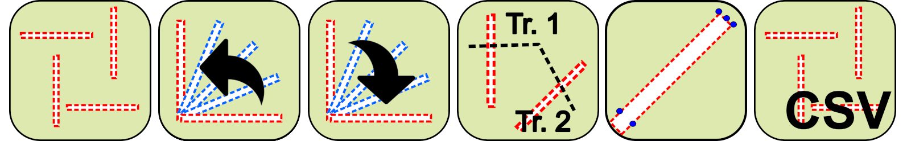

<strong>Evaluation Trench Generator</strong> is an internal QGIS Plugin specifically built for PCA that provide a set of tools to generates trenches for archaeological evaluations and to generate the necessary files to configurate the GNSS setout.

